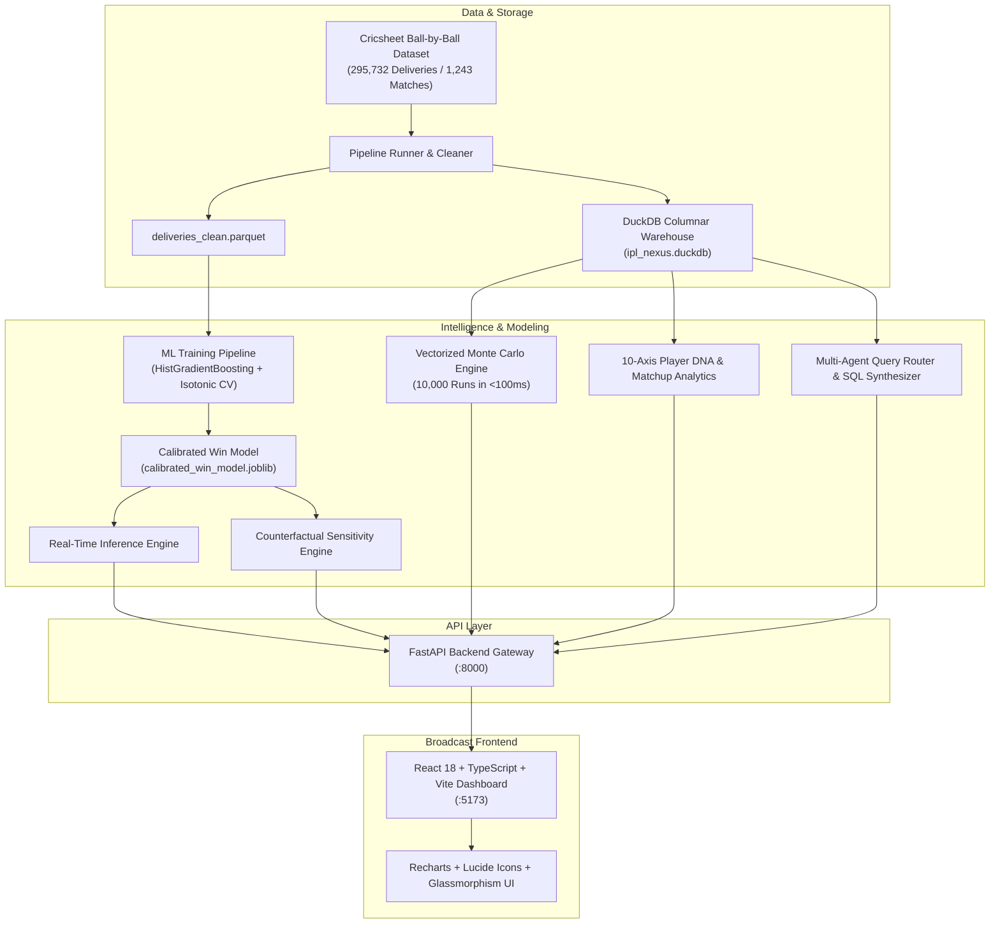

# IPL Nexus — Explainable AI & Decision Intelligence Platform for T20 Cricket

[](https://fastapi.tiangolo.com)
[](https://react.dev)
[](https://duckdb.org)
[](https://python.org)
[](https://vitejs.dev)
[](https://opensource.org/licenses/MIT)

**IPL Nexus** is a state-of-the-art cricket analytics and decision intelligence platform. Moving beyond traditional scoreboards and basic website clones, IPL Nexus provides broadcast-grade sports intelligence combining an embedded **DuckDB OLAP warehouse** (295,732 deliveries across 1,243 IPL matches from 2008 through 2025), a **Calibrated Gradient Boosting Win Predictor**, **Counterfactual Explainable AI (XAI)**, a **10,000-run Monte Carlo What-If Simulator**, **10-Axis Player DNA Radars**, and an **Evidence-Grounded Multi-Agent Assistant**.

---

## ⚡ Key Highlights & Core Capabilities

- 🏟️ **Live Broadcast Telemetry**: Real-time win probability gauge, Dynamic Pressure Index (DPI 0–100), over-by-over ball ticker, and match-defining Turning Point detector ($|\Delta P_{\text{win}}| \ge 8\%$).
- 🧠 **Calibrated Win Probability Engine**: HistGradientBoosting classifier with 3-fold Isotonic Regression calibration ($70.38\%$ accuracy, $0.7917$ ROC-AUC, well-calibrated Brier Score of $0.1877$).
- 🔬 **Counterfactual Explainable AI (XAI)**: Sensitivity modeling for strategic what-if questions (*"What happens to win probability if a wicket falls next over?"* or *"What if the next over yields 14 runs?"*).
- 🎲 **Vectorized Monte Carlo Simulator**: Simulates 10,000 probabilistic match trajectories in $<100\text{ms}$ with score distributions and 90% confidence intervals.
- 🧬 **10-Axis Situational Player DNA Radar**: Multi-dimensional capability vectors measuring Aggression, Powerplay Index, Death Strike Rate, Dot Ball Resistance, and Pressure Resilience.
- 👑 **Franchise War Room & Squad HQ**: Executive dossiers across all 10 IPL franchises with fortress dominance deltas, 10x10 rivalry battlefield, Playing XI Lineup Architect enforcing official IPL rules (including Impact Player substitution), and Mega Auction ₹120 Cr purse optimizer.
- 🏟️ **Stadium & Pitch Matrix Intelligence**: Broadcast venue dossiers across all premier grounds with toss/dew bias, pace vs spin splits, boundary dimensions, and phase scoring curves.
- ⚔️ **Fight-Card Head-to-Head Duel Engine**: Micro-level batter vs. bowler analysis with boundary percentages, phase splits, and tactical bowler deployment recommendations.
- 🤖 **Evidence-Grounded Multi-Agent Assistant**: Natural language query router backed by deterministic SQL execution proofs directly against DuckDB analytical tables.


---

## 🏗️ System Architecture



---

## 📊 Machine Learning Benchmarks

The win probability engine was trained on 291,580 historical match states and evaluated against holdout test sets:

| Metric | Score | Target / Benchmark |
| :--- | :--- | :--- |
| **Accuracy** | **70.38%** | Baseline T20 benchmark |
| **ROC-AUC** | **0.7917** | $> 0.75$ strong discriminatory power |
| **Brier Score** | **0.1877** | $< 0.19$ (strictly calibrated probabilities) |
| **Log Loss** | **0.5581** | Minimal cross-entropy loss |
| **Calibration Method** | **Isotonic Regression (3-Fold CV)** | Prevents uncalibrated extreme predictions |

---

## 🚀 Getting Started

### Prerequisites
- **Python**: 3.10 or 3.11+
- **Node.js**: 18+ or 20+

### 1. Clone the Repository
```bash
git clone https://github.com/vasudev1876961/IPL-NEXES.git
cd IPL-NEXES
```

### 2. Backend Setup
```bash
# Create and activate Python virtual environment
python -m venv .venv

# Windows:
.venv\Scripts\activate
# macOS/Linux:
source .venv/bin/activate

# Install dependencies
pip install -r requirements.txt

# Start FastAPI development server
uvicorn backend.app.main:app --host 127.0.0.1 --port 8000 --reload
```
API docs available at: `http://127.0.0.1:8000/docs`

### 3. Frontend Setup
```bash
cd frontend

# Install npm dependencies
npm install

# Start Vite development server
npm run dev
```
Open your browser at: `http://127.0.0.1:5173/`

### 4. Running Backend Tests
```bash
pytest backend/tests/test_api.py -v
```

---

## 📂 Project Structure

```
IPL-NEXES/
├── ai/
│   └── agents/                 # Multi-agent assistant & SQL proof generator
├── analytics/                  # Momentum, pressure, player DNA & strategy engines
│   ├── contextual_score.py
│   ├── matchups.py
│   ├── momentum.py
│   ├── player_dna.py
│   ├── pressure.py
│   └── strategy.py
├── backend/
│   ├── app/
│   │   ├── api/                # FastAPI router endpoints (matches, players, matchups, prediction, simulation, chat)
│   │   └── main.py
│   └── tests/                  # Integration and unit tests
├── data/
│   ├── raw/                    # Raw ball-by-ball dataset
│   └── processed/              # Cleaned parquet data files
├── data_pipeline/              # Ingestion, cleaning, and DuckDB warehouse loader
├── frontend/
│   ├── src/
│   │   ├── components/         # Radar, momentum wave, score distribution & gauge charts
│   │   ├── pages/              # Match Center, Player Lab, Duel Explorer, What-If Simulator, AI Assistant
│   │   ├── services/           # Axios API client
│   │   └── utils/              # Team styling tokens and palette definitions
│   └── package.json
├── ml/
│   ├── explainability/         # Counterfactual XAI engine
│   ├── inference/              # Sub-millisecond win probability predictor
│   ├── models/                 # Calibrated model artifacts & model card
│   ├── simulation/             # 10,000-run Monte Carlo simulation engine
│   └── training/               # Model training and calibration pipeline
└── requirements.txt
```

---

## 🛡️ License

This project is licensed under the MIT License - see the [LICENSE](LICENSE) file for details.
